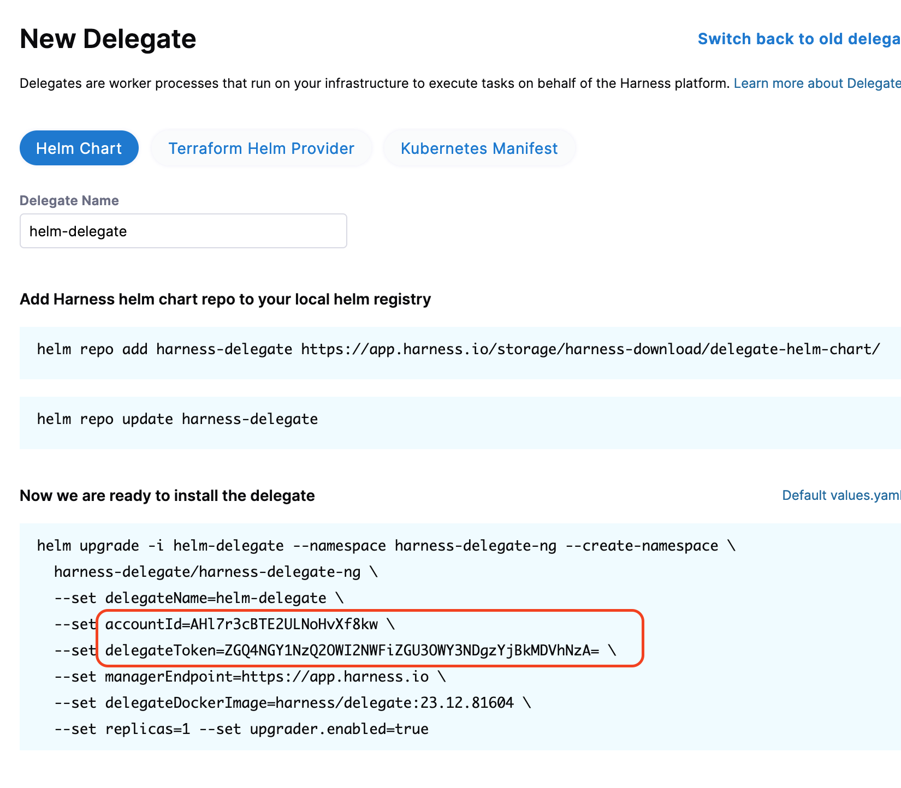

# Harness TF Delegate

Use Terraform to stand up a Harness Delegate.

## Use

1. Update `vars.tf` if needed. The default values are sufficient to spin up a Delegate.

### Run

This is designed for an interactive shell session. You will be promted for a Harness Account ID and Delegate Token.

```
terraform init
terraform apply
```

Navigate to Delegate screen in the app.harness.io UI to find the account ID and Delegate Token.



### Variables to update

- `delegate_image` - update to latest (as of last update: `harness/delegate:23.12.81604`)
